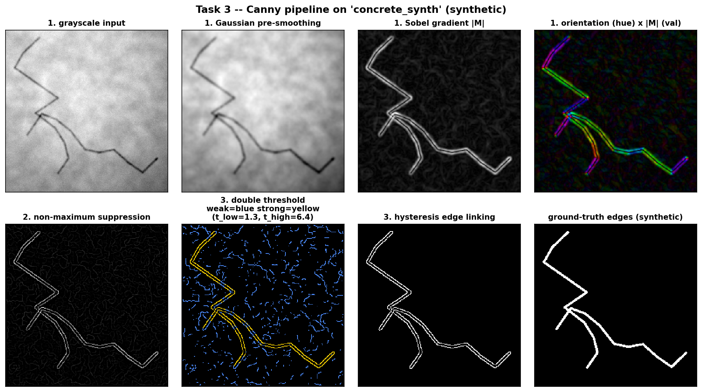
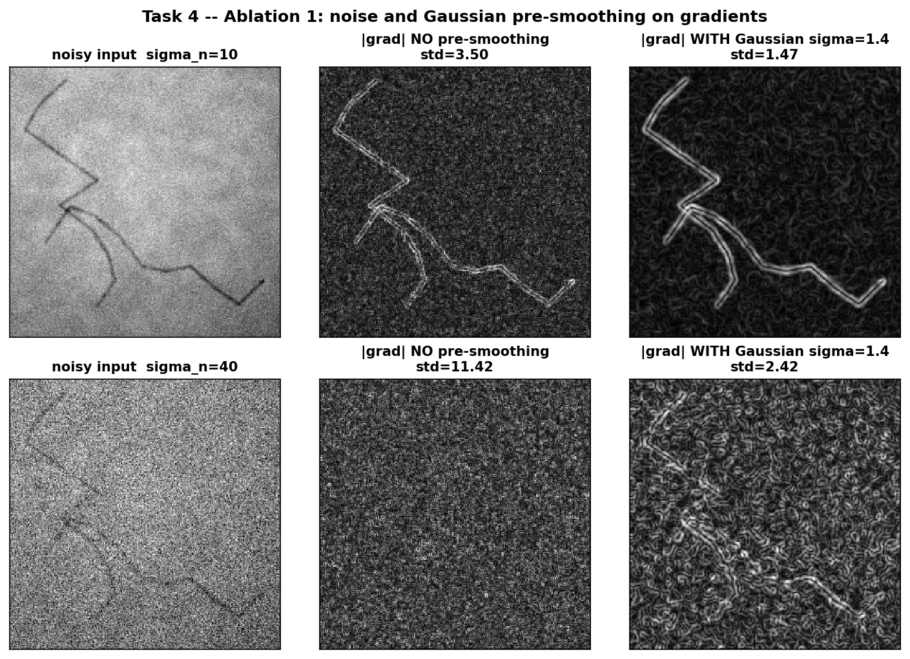
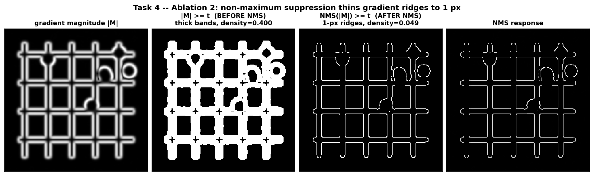
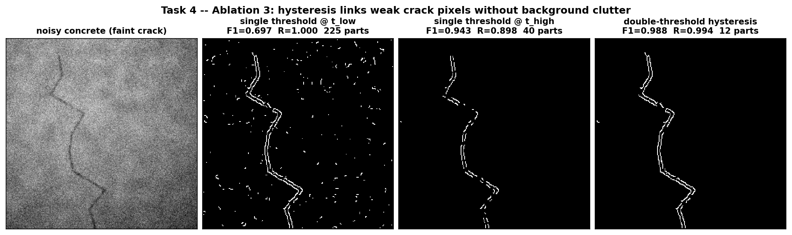
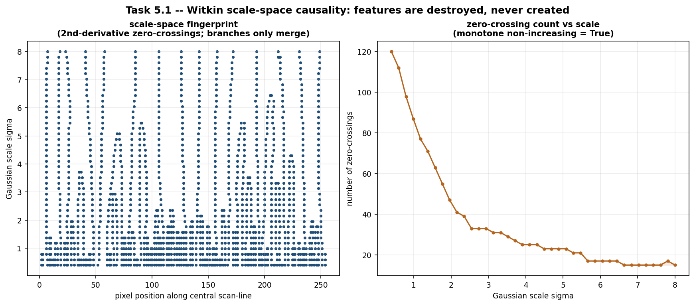
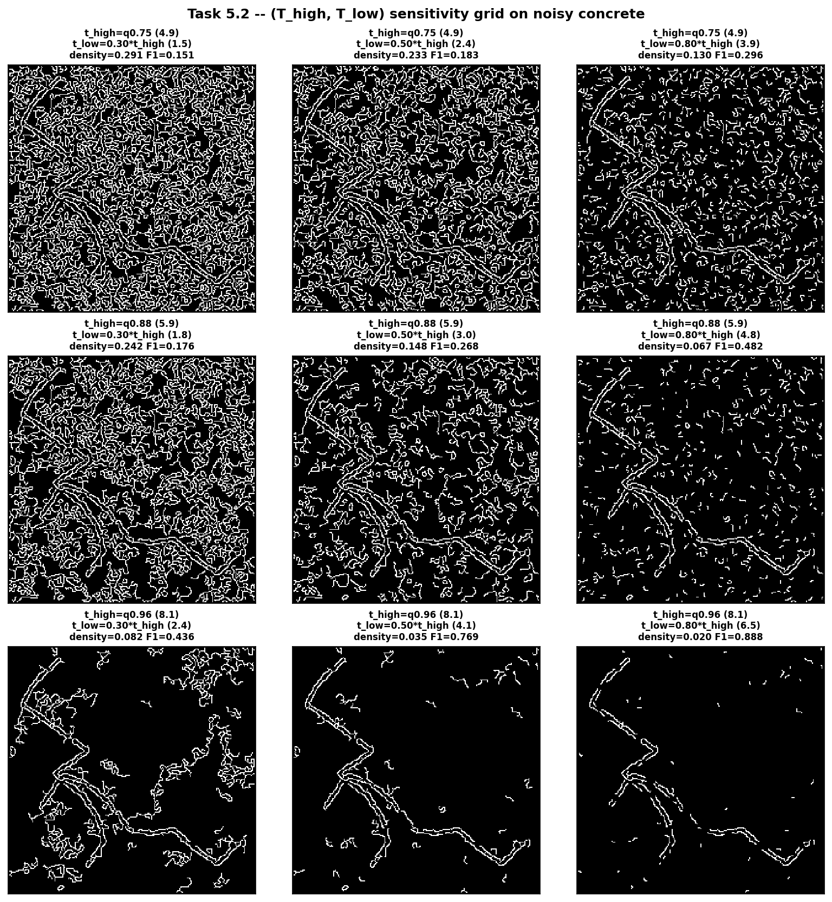
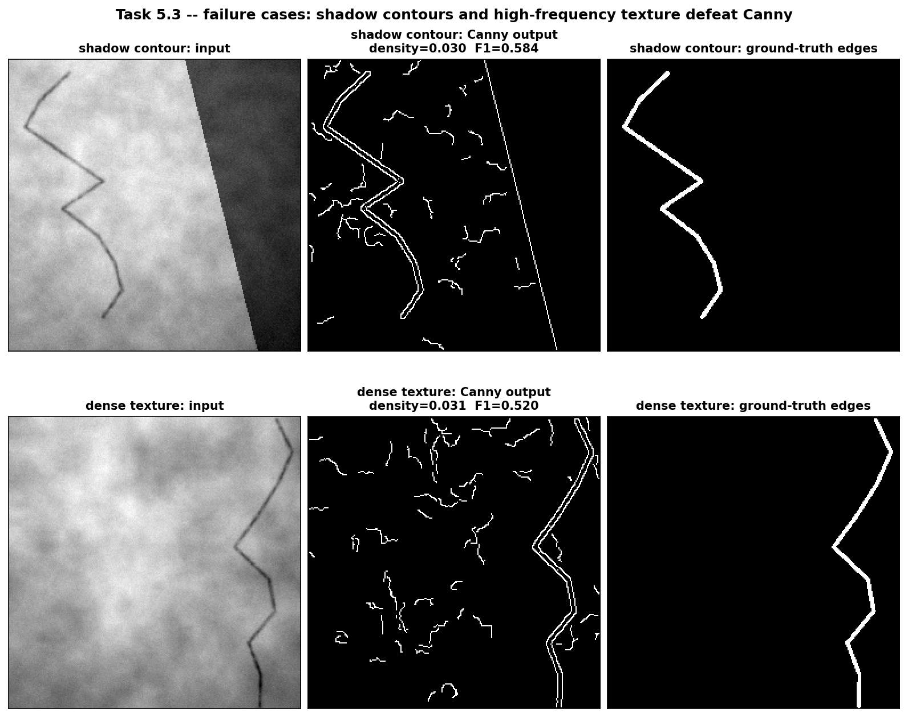

<!-- markdownlint-disable MD033 MD041 -->
<h1 align="center">Industrial Defect Inspection &amp; Surface-Crack Detection</h1>
<p align="center">
  <em>From-scratch spatial convolution, linear filtering and a four-stage Canny edge detector — pure vectorised NumPy, zero built-in filtering calls.</em>
</p>

<p align="center">
  
  
  
  
  
</p>

<p align="center">
  
</p>

> **Course context** — CS4059 *Fundamentals of Computer Vision*, FAST-NUCES, Fall 2026, Assignment 1.
> **Author** — Shahoud Shahid · Roll No. 23i-2515 · Section DS-A.
> Built as a production-grade project: packaged library, CLI, test suite, CI, reproducible figures and a LaTeX report.

---

## Table of contents

- [What this is](#what-this-is)
- [Highlights](#highlights)
- [Repository layout](#repository-layout)
- [Quickstart](#quickstart)
- [Datasets (real &amp; synthetic)](#datasets-real--synthetic)
- [Running the experiments](#running-the-experiments)
- [Results gallery](#results-gallery)
- [Library API](#library-api)
- [Testing &amp; quality](#testing--quality)
- [Building the report](#building-the-report)
- [Assignment compliance](#assignment-compliance)
- [Assumptions](#assumptions)
- [Roadmap](#roadmap)
- [License](#license)

---

## What this is

A complete **visual quality-inspection & micro-crack-profiling pipeline** implemented
from mathematical first principles. Every operator — 2-D/3-D convolution, the
Gaussian kernel, unsharp masking, pooling, Sobel gradients, non-maximum
suppression, double-threshold hysteresis — is derived from its defining equation
and written in vectorised NumPy. OpenCV is used **only** for `imread`/`imwrite`.

The five assignment tasks are packaged as:

| Layer | Where | What |
|---|---|---|
| **Library** | [`src/cvlab/`](src/cvlab) | `conv2d`, `conv3d`, `generate_gaussian_kernel_2d`, `unsharp_mask`, `pool2d`, `max_pool_gradient`, `sobel_gradients`, `non_max_suppression`, `double_threshold`, `hysteresis`, `canny`, metrics, synthetic datasets |
| **Experiments** | [`src/experiments/`](src/experiments) | one reproducible driver per task, writing figures to `output_images/` and metrics to `results/` |
| **CLI** | `cvlab` | `cvlab all` or `cvlab task3 --prefer synthetic` |
| **Tests** | [`tests/`](tests) | 124 tests incl. a slow end-to-end smoke test |
| **Report** | [`report/`](report) | modular LaTeX → `report.pdf` (4-page IEEE) + `supplementary.pdf` |

## Highlights

- **Vectorised to the metal** — `conv2d`/`conv3d` are a single `np.einsum` over a
  `sliding_window_view`; NMS pre-shifts eight padded copies and selects per
  orientation sector with `np.select`. No Python pixel loops. Full 5-task suite
  runs in **~16 s** on a laptop CPU.
- **Two hysteresis implementations** — a deque BFS (matches the brief skeleton)
  and a fixed-point 8-connected dilation — asserted bit-identical in tests.
- **Honest quantitative evaluation** — synthetic samples carry an exact
  ground-truth edge mask, so ablations report tolerance-aware
  precision/recall/F₁, not just eyeballed figures.
- **Reproducible from a clean environment** — no credentials needed; procedural
  datasets stand in for Kaggle and every figure regenerates from seed `2515`.
- **Ship-ready** — `pyproject.toml`, `ruff` + `mypy` config, `pre-commit`,
  GitHub Actions for tests **and** the LaTeX build, MIT-licensed.

## Repository layout

```
.
├── src/
│   ├── cvlab/                     # the library (installable package)
│   │   ├── convolution.py         # Task 1: conv2d, conv3d
│   │   ├── filters.py             # Task 2: Gaussian kernel, unsharp mask, Sobel
│   │   ├── pooling.py             # Task 2: pool2d + analytical gradients
│   │   ├── canny.py               # Task 3: 4-stage pipeline
│   │   ├── noise.py               # Task 4: additive Gaussian / salt-pepper
│   │   ├── metrics.py             # P/R/F1, edge density, components
│   │   ├── datasets.py            # real loader + procedural PCB/concrete
│   │   ├── viz.py                 # matplotlib helpers (Agg backend)
│   │   ├── utils.py               # padding, normalisation, image I/O
│   │   └── cli.py                 # `cvlab` entry point
│   └── experiments/
│       ├── run_task1_convolution.py … run_task5_analysis.py
│       └── run_all.py
├── tests/                         # pytest suite (124 tests)
├── report/                        # LaTeX sources + Makefile
├── scripts/                       # download_data · report_numbers · build_submission
├── output_images/                 # generated figures (committed)
├── results/                       # generated metrics JSON (committed)
├── docs/                          # ASSUMPTIONS · DESIGN · REQUIRED_VS_ENHANCEMENTS
├── data/raw/                      # (gitignored) real Kaggle images go here
├── pyproject.toml · Makefile · .pre-commit-config.yaml
└── .github/workflows/             # ci.yml · report.yml
```

## Quickstart

```bash
# 1. clone, then create an isolated environment (recommended on Windows —
#    avoids a broken user site-packages shadowing the install)
python -m venv .venv
source .venv/bin/activate            # Windows: .venv\Scripts\activate

# 2. install the package + dev tooling
pip install -e ".[dev]"

# 3. regenerate every figure and metric (synthetic data, ~16 s)
cvlab all

# 4. run the test suite
pytest -q
```

Outputs land in [`output_images/`](output_images) and [`results/`](results).
Add `--prefer synthetic` to force procedural data, `--dpi 200` for print-quality
figures, `--data-dir data/raw` to use real Kaggle images.

## Datasets (real & synthetic)

The brief benchmarks on two Kaggle sets:

| Key | Kaggle | Content |
|---|---|---|
| `pcb` | [`akhatova/pcb-defects`](https://www.kaggle.com/datasets/akhatova/pcb-defects) | PCB images: mouse bites, spurs, shorts, opens |
| `concrete` | [`arunrk7/surface-crack-detection`](https://www.kaggle.com/datasets/arunrk7/surface-crack-detection) | concrete surfaces with fine cracks |

Both need a Kaggle account, so the pipeline **also** ships deterministic
procedural generators (`cvlab.datasets.synthetic_pcb`, `synthetic_concrete`)
whose statistics match the real data and which expose an exact ground-truth
mask. To use the real images:

```bash
pip install -e ".[data]"                 # installs kagglehub
#  put your token at ~/.kaggle/kaggle.json
python scripts/download_data.py          # -> data/raw/pcb, data/raw/concrete
cvlab all --data-dir data/raw --prefer real
```

`--prefer auto` (default) uses real images when present and falls back to
synthetic otherwise.

## Running the experiments

| Command | Task | Key outputs |
|---|---|---|
| `cvlab task1` | 2-D/3-D convolution engines | `task1_conv2d_kernels.png`, `task1_conv2d_strided.png`, `task1_conv3d_activations.png`, shape-verification JSON |
| `cvlab task2` | Gaussian kernel · unsharp mask · pooling | `task2_gaussian_kernels.png`, `task2_unsharp_*.png`, `task2_pooling*.png` |
| `cvlab task3` | full Canny pipeline | `task3_canny_pcb.png`, `task3_canny_concrete.png`, `task3_canny_summary.png` |
| `cvlab task4` | visual ablations | `task4_ablation1_noise_smoothing.png`, `task4_ablation2_nms.png`, `task4_ablation3_hysteresis.png` |
| `cvlab task5` | scale-space · sensitivity · failure | `task5_scale_space*.png`, `task5_sensitivity_grid_*.png`, `task5_failure_*.png` |
| `cvlab all` | everything + `results/figure_manifest.json` | 20 figures, 6 JSON files |

Each driver is also runnable directly: `python -m experiments.run_task3_canny`.

## Results gallery

| Task 4 — noise vs. smoothing | Task 4 — NMS thinning |
|---|---|
|  |  |

| Task 4 — hysteresis vs. single threshold | Task 5 — scale-space causality |
|---|---|
|  |  |

| Task 5 — (T_high, T_low) sensitivity | Task 5 — failure cases |
|---|---|
|  |  |

Selected numbers (seed `2515`, synthetic data):

| Result | Value |
|---|---|
| `conv2d` output shape vs. discrete formula | 7/7 geometries exact |
| max-pool gradient `[[8,7],[12,9]]` → `∂out/∂in` | `[[0,0],[1,0]]` (FD-verified) |
| Gaussian pre-smoothing, noise suppression @ σ_n=40 | **4.7×** lower gradient σ |
| NMS thinning ratio | **8.1×** |
| Hysteresis vs. single-threshold crack F₁ | 0.943 → **0.988**, fragments 40 → **12** |
| Scale-space edge count σ = 1.0 / 2.5 / 5.0 | 2055 / 1418 / 881 (monotone ↓) |
| Canny F₁ — PCB / concrete | 0.931 / 1.000 |

## Library API

```python
import numpy as np
from cvlab import (
    conv2d,
    conv3d,
    generate_gaussian_kernel_2d,
    unsharp_mask,
    pool2d,
    max_pool_gradient,
    canny,
)

img = np.random.default_rng(0).random((256, 256)) * 255

# Task 1 — strided convolution, output matches ⌊(W−F+2P)/S⌋+1
edges_x = conv2d(img, np.array([[-1, 0, 1]] * 3) / 6, stride=1, padding="same")
act = conv3d(np.dstack([img] * 3), np.random.rand(4, 3, 3, 3), padding="same")  # (H,W,4)

# Task 2
k = generate_gaussian_kernel_2d(5, sigma=1.0)  # sums to 1.0 exactly
sharp = unsharp_mask(img, sigma=1.5, alpha=1.2)  # clipped to [0,255]
pooled = pool2d(sharp, (2, 2), stride=2, mode="max")
routing = max_pool_gradient(np.array([[8.0, 7.0], [12.0, 9.0]]), (2, 2), 2)  # [[0,0],[1,0]]

# Task 3 — full detector, or every intermediate stage
edges = canny(img, sigma=1.4, low_q=0.7, high_q=0.92)  # uint8 {0,255}
stages = canny(img, sigma=1.4, return_stages=True)  # CannyStages(...)
```

## Testing & quality

```bash
pytest -q                       # 124 tests, ~15 s (fast subset ~3 s)
pytest -q -m "not slow"         # skip the end-to-end smoke test
pytest --cov=cvlab              # coverage (~85 %, canny.py 96 %)
ruff check . && ruff format --check .
mypy src/cvlab
pre-commit run --all-files
```

What the tests pin down: the discrete size formula across a geometry sweep;
`conv2d`≡`conv3d` on one channel; linearity; Gaussian unit sum / symmetry /
closed form; unsharp bounds & high-frequency gain; the max-pool routing matrix
(analytic == finite difference); NMS 1-px thinning and border zeroing;
hysteresis BFS == iterative, diagonal connectivity, weak-bridge linking; blank
image ⇒ no edges; noise σ recovery; synthetic-dataset contract; image I/O
round-trip.

## Building the report

```bash
cd report
make            # report.pdf (4-page IEEE) + supplementary.pdf
```

No local LaTeX? Push to GitHub (`.github/workflows/report.yml` builds both PDFs),
or upload `report/` + `output_images/` to Overleaf. Details in
[`report/README.md`](report/README.md).

## Assignment compliance

| Task | Requirement | Status |
|---|---|---|
| 1 | `conv2d` with `same`/`valid`, stride, discrete size formula | ✅ `src/cvlab/convolution.py`, `tests/test_convolution.py` |
| 1 | `conv3d` K filters → `(H_out, W_out, K)` activation volume | ✅ |
| 2 | `generate_gaussian_kernel_2d` via meshgrid, Σ = 1 | ✅ `src/cvlab/filters.py` |
| 2 | `unsharp_mask` `F + α(F − F∗G)`, clipped | ✅ |
| 2 | `pool2d` max & average; max-pool gradient for `[[8,7],[12,9]]` | ✅ code + report §II-C / Appendix A |
| 3 | Sobel (1/8) magnitude + `atan2` direction | ✅ `src/cvlab/canny.py` |
| 3 | 4-sector NMS, strict `>`, border = 0 | ✅ |
| 3 | double threshold + 8-connected hysteresis | ✅ (BFS + iterative) |
| 4 | Ablations: noise→smoothing, pre/post NMS, hysteresis vs single | ✅ `task4_*` |
| 5 | Scale-space causality σ∈{1,2.5,5}; 3×3 (T_high,T_low) grid; ≥2 failure cases | ✅ `task5_*` |
| — | `src/`, `output_images/`, `report.pdf` ≤ 4 pages | ✅ `scripts/build_submission.py` |

## Assumptions

Full list in [`docs/ASSUMPTIONS.md`](docs/ASSUMPTIONS.md). In brief: cross-correlation
(brief §1.2); odd kernels; `reflect` padding for blur/Sobel then explicit border
zeroing in NMS (brief §2.3); quantile auto-thresholds by default (absolute also
accepted); BT.601 luma; deterministic RNG seeded at `2515`; synthetic datasets
when Kaggle credentials are absent.

## Roadmap

- [ ] Illumination-invariant pre-processing (homomorphic / retinex) for the shadow failure case
- [ ] Oriented crack-matched filters / Frangi ridge measure for dense-texture surfaces
- [ ] Separable-Gaussian scale-space pyramid for faster multi-σ analysis
- [ ] Optional Numba/`stride_tricks` fast path benchmarked against the einsum core
- [ ] Streamlit demo for interactive `(σ, T_high, T_low)` exploration

## License

[MIT](LICENSE). Coursework — if you are enrolled in CS4059 or an equivalent,
use for reference only; do not submit as your own.
